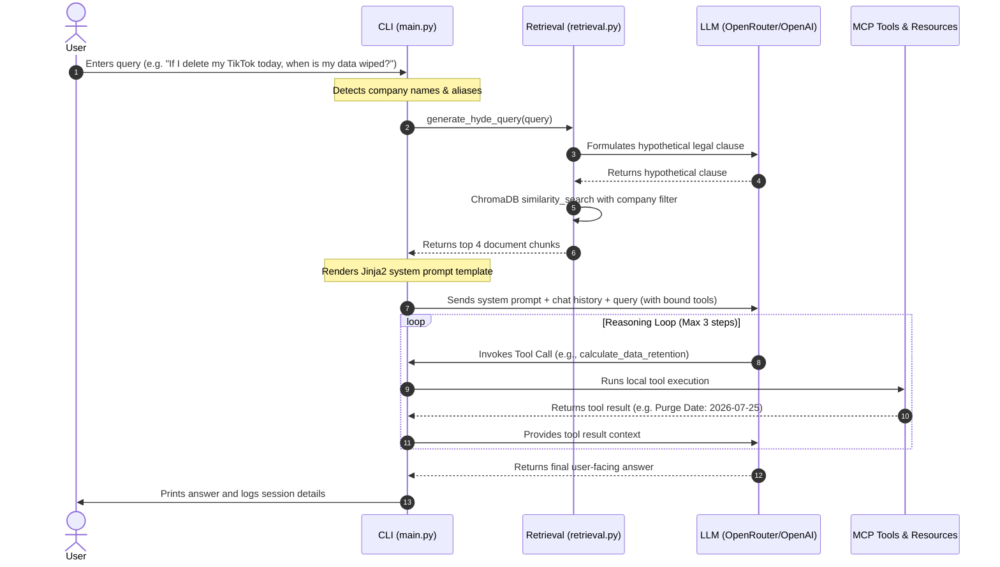

# 🔒 Ma'at: Privacy Policy & Terms of Service (ToS) Analyzer

[](https://www.python.org/)
[](https://github.com/langchain-ai/langchain)
[](https://github.com/modelcontextprotocol)
[](https://github.com/chroma-core/chroma)

Privacy policies and Terms of Service (ToS) agreements are notoriously long, dense, and filled with legal jargon. **Ma'at** is a legal-focused AI assistant that empowers everyday users to understand how their data is handled. By combining **Retrieval-Augmented Generation (RAG)** with local semantic storage, advanced query generation, and the **Model Context Protocol (MCP)**, this system translates complex legal obligations into concise, layperson-friendly answers.

---

## 🌟 Key Features

* **RAG with Hypothetical Document Embeddings (HyDE)**  
  Rather than matching user queries directly to dry legal documents, [generate_hyde_query()](file:///home/os14you/Projects/privacy-bot/privacy-analyzer/rag/retrieval.py#L35) prompts the LLM to draft a hypothetical policy clause first. This hypothetical clause is then embedded to query ChromaDB, substantially improving the retrieval accuracy of relevant clauses.
* **Smart Domain Filtering**  
  The system detects the company names present in the query (via [get_matching_companies()](file:///home/os14you/Projects/privacy-bot/privacy-analyzer/rag/retrieval.py#L49)) and applies metadata filtering dynamically, preventing cross-policy contamination during vector search.
* **Model Context Protocol (MCP) Integration**  
  A custom [server.py](file:///home/os14you/Projects/privacy-bot/privacy-analyzer/mcp_server/server.py) built on `FastMCP` exposes tools and resources directly to the LLM agent, enhancing its analytical capabilities.
* **Custom Agentic Tools**  
  * [calculate_data_retention()](file:///home/os14you/Projects/privacy-bot/privacy-analyzer/mcp_server/server.py#L7): Computes the exact future date when personal data is purged (e.g., "30 days after deletion").
  * [define_legal_term()](file:///home/os14you/Projects/privacy-bot/privacy-analyzer/mcp_server/server.py#L23): Provides accessible definitions for dense legal jargon like *arbitration*, *third-party*, *indemnification*, and *force majeure*.
  * **CCPA Statutory Resource**: Exposes static context for the California Consumer Privacy Act (`legal://user-rights/ccpa`) via [get_ccpa_rights()](file:///home/os14you/Projects/privacy-bot/privacy-analyzer/mcp_server/server.py#L42) to inform rights-based user queries.
* **Jinja2 Guided ReAct Loop**  
  Integrates template-driven prompt rendering via [prompts.yml](file:///home/os14you/Projects/privacy-bot/privacy-analyzer/prompts.yml) to guide the LLM's reasoning and control how external tools are engaged.
* **Session Logging & Animated CLI**  
  Features an interactive CLI shell in [main.py](file:///home/os14you/Projects/privacy-bot/main.py) with [LoadingAnimation](file:///home/os14you/Projects/privacy-bot/main.py#L9) threads for reasoning states, keeping track of conversation history and exporting detailed session logs automatically.

---

## ⚙️ Architecture & Pipeline Flow

The execution workflow proceeds through a structured pipeline for every query:



---

## 🛠️ Prerequisites & Installation

### Prerequisites
* **Python 3.14+**
* **uv** (recommended Python package installer and virtual environment manager)
* An active **OpenRouter API Key** (or standard **OpenAI API Key**)

### Installation

1. Clone or download the repository into your workspace.
2. Initialize the project and install all required packages:
   ```bash
   uv sync
   ```
   *(This downloads and installs all dependencies listed in [pyproject.toml](file:///home/os14you/Projects/privacy-bot/pyproject.toml) including `langchain`, `langchain-chroma`, `fastmcp`, `chromadb`, and `sentence-transformers`).*

### Configuration

Create a `.env` file in the `privacy-analyzer/` folder:
```env
OPENROUTER_API_KEY="your_openrouter_api_key_here"
OPENROUTER_API_BASE="https://openrouter.ai/api/v1"
OPENROUTER_MODEL="openrouter/owl-alpha"
```
*(If you do not specify an `OPENROUTER_API_KEY`, the application will fall back to using your global `OPENAI_API_KEY` environment variable and target `gpt-4o-mini`).*

---

## 🚀 Usage Guide

### 1. Download Legal Policies
To fetch the raw legal policies dataset (extracted from the *Princeton-Leuven Longitudinal Privacy Policy Dataset*), run the automated downloader script:
```bash
uv run python privacy-analyzer/scripts/download_data.py
```
This fetches 37 markdown files of famous companies (e.g., Google, Facebook, Reddit, Microsoft, Slack) and saves them to the data directory.

### 2. Build the RAG Vector Index
To chunk the documents, generate embeddings (using the local `all-MiniLM-L6-v2` model to save API costs), and persist them to ChromaDB, execute the indexing module:
```bash
uv run python privacy-analyzer/rag/indexing.py
```
This runs [build_index()](file:///home/os14you/Projects/privacy-bot/privacy-analyzer/rag/indexing.py#L7) to process files and split paragraphs using LangChain's `RecursiveCharacterTextSplitter` (chunk size of 1000, overlap of 200).

### 3. Run the MCP Server
To host the custom legal tools and resources, launch the FastMCP server.

* **Development Mode (with Web-based MCP Inspector)**:
  ```bash
  uv run fastmcp dev inspector privacy-analyzer/mcp_server/server.py:mcp
  ```
* **Standard Stdin/Stdout Production Mode**:
  ```bash
  uv run fastmcp run privacy-analyzer/mcp_server/server.py:mcp
  ```

### 4. Run the Agentic CLI Shell (Main Interface)
To launch the interactive CLI loop and query the policies, execute:
```bash
uv run python main.py
```
Type your query at the `Query >` prompt. The CLI logs all activity to automatically generated session log files stored in the `logs/` directory.

### 5. Run the ReAct Agent Demo
To run the automated test suite executing specific queries through the Agent loop (using [run_agent()](file:///home/os14you/Projects/privacy-bot/privacy-analyzer/examples/demo.py#L67)), run:
```bash
uv run python privacy-analyzer/examples/demo.py
```

---

## 📊 Evaluation & Quality Assurance

To evaluate performance, the system is tested against a 10-query benchmark suite specified in [test_queries.json](file:///home/os14you/Projects/privacy-bot/privacy-analyzer/evaluation/test_queries.json). This benchmark tests RAG retrieval, HyDE query expansion precision, and tool utilization.

Detailed results and learnings are documented in [results.md](file:///home/os14you/Projects/privacy-bot/privacy-analyzer/evaluation/results.md).

### Summary of Results

| Q# | Question | Retrieval Precision | Relevance Score (1-5) | Notes / Capabilities Tested |
| :--- | :--- | :---: | :---: | :--- |
| 1 | Does Spotify share listening history... | **Yes** | **5** | Basic Retrieval |
| 2 | What is the arbitration clause for Amazon? | **Yes** | **5** | HyDE Jargon Matching |
| 3 | How long does Netflix keep payment data... | **Yes** | **4** | Temporal clause retrieval |
| 4 | If I delete my TikTok today, when is it wiped? | **Yes** | **5** | [calculate_data_retention()](file:///home/os14you/Projects/privacy-bot/privacy-analyzer/mcp_server/server.py#L7) + RAG |
| 5 | What does 'Force Majeure' mean? | **N/A** | **5** | [define_legal_term()](file:///home/os14you/Projects/privacy-bot/privacy-analyzer/mcp_server/server.py#L23) Tool execution |
| 6 | Does Meta collect my GPS location? | **Yes** | **5** | Location-tracking section isolation |
| 7 | Do I have the right to opt-out under CCPA? | **N/A** | **5** | [get_ccpa_rights()](file:///home/os14you/Projects/privacy-bot/privacy-analyzer/mcp_server/server.py#L42) Resource query |
| 8 | Can Google read my private emails for ads? | **Yes** | **4** | Standard email RAG query |
| 9 | Account consequences for violating Twitch ToS? | **Yes** | **4** | Service suspension clause retrieval |
| 10| What is 'Indemnification' in user content? | **Yes** | **5** | Combined RAG + Dictionary Tool |

### Engineering Learnings & Failure Case Mitigations

1. **Failure Case 1 (Agent Parsing)**: In the prototype, text-based ReAct parsing (`[TOOL_CALL: ...]`) was prone to LLM output formatting errors. This was resolved by migrating to **native LLM tool calling** via LangChain's `bind_tools`, ensuring structured arguments.
2. **Failure Case 2 (RAG Breadth)**: Queries targeting global summaries (e.g., *"What total data does Google collect?"*) occasionally missed parts of the document due to retrieval limits ($k=4$). Implementing a Map-Reduce summary pipeline is recommended for global summarization tasks.
